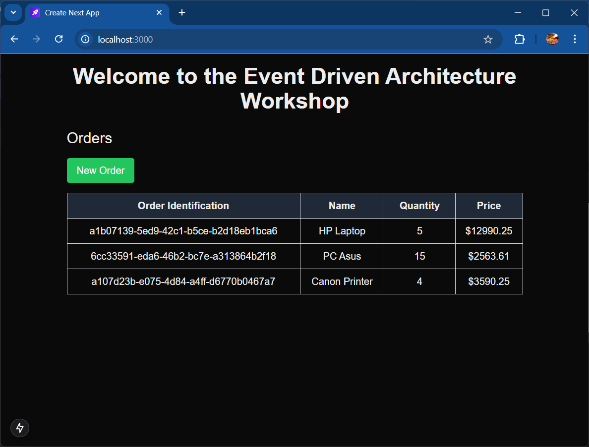

# Event-Driven Architectural Pattern

This repository showcases an event-driven architecture implemented with Spring Boot and Apache Kafka.


### Repository Description

In this architecture, the ***OrderService***, ***PaymentService***, and ***EmailService*** microservices operate independently and communicate via event-driven messaging.

- **OrderService:** A producer application that generates events and sends them to a Kafka message broker.
- **PaymentService:** A consumer microservice responsible for processing events related to payment processing.
- **EmailService:** Another consumer microservice that handles email notifications based on events.

This repository contains code, configuration, and resources for building and deploying this event-driven system. It serves as a practical example for those interested in implementing event-driven architectures with Spring Boot and Kafka.

### Operation

1. Start the Kafka broker using Docker Compose:

```bash
docker-compose up -d
```

2. Start the OrderService, PaymentService, and EmailService applications.
3. Send a POST request to the OrderService to create a new order:

```bash
curl -X 'POST' \
  'http://localhost:9001/order-service/v1/orders' \
  -H 'accept: */*' \
  -H 'Content-Type: application/json' \
  -d '{
  "name": "Laptop PC",
  "qty": 10,
  "price": 12499.99
}'
```

4. Check the logs of the PaymentService and EmailService to see the events being processed.
5. Verify that the order was processed successfully.

Feel free to customize the description to better suit your specific project's goals and scope.

### Kafka UI

You can access the Kafka UI by visiting [http://localhost:7000](http://localhost:7000) in your web browser.

## Frontend

The frontend application is a demo Next application that allows users to create new orders. It communicates with the OrderService via REST API which acts as a producer and sends events to the Kafka broker.



### Author

Created by **Raul Bolivar Navas** [rasysbox.com](https://rasysbox) - feel free to contact us!

---
### License
This project is licensed under the terms of the MIT license.

